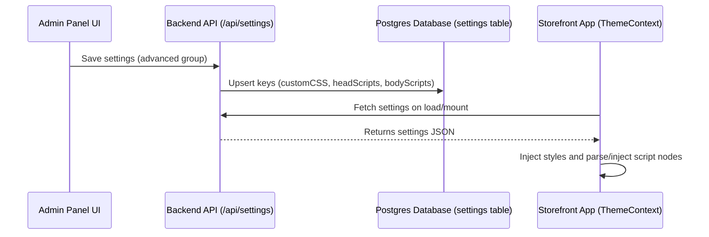

# Custom Code & Script Injection

This document describes the design, implementation, and security context of the Custom Code Injection system, which allows administrators to inject custom CSS, HTML, and JavaScript (e.g. analytics trackers, helper widgets, meta tags, and style overrides) directly into the storefront.

---

## 1. System Overview

The system consists of three integration points:
1. **Custom CSS**: Appends a `<style>` element directly into `document.head` to override storefront styles.
2. **Header Scripts**: Parses and appends HTML tags (such as `<script>`, `<link>`, `<meta>`) to the storefront `<head>` section.
3. **Body Scripts**: Parses and appends HTML tags (such as tracking scripts, widgets) at the end of the storefront `<body>` section.

### Architectural Flow



---

## 2. Technical Implementation Details

### Database & Backend Validation

- Settings keys (`customCSS`, `headScripts`, `bodyScripts`) are registered under the `advanced` settings group in `config/default.json`.
- The database model (`server/src/modules/settings/settings.model.js`) validates setting group names. The `'advanced'` group is whitelisted in the Sequelize schema's `isIn` constraint.

### Storefront Script Injection Engine

In modern browsers, assigning an HTML string containing `<script>` tags to `element.innerHTML` **will not execute the scripts** due to HTML5 security specifications.

To overcome this inside a Single Page Application (SPA), the injection engine in `client/src/context/ThemeContext.jsx` utilizes `DOMParser` to process scripts:

1. **DOM Parsing**: Parses the HTML snippet string inside a temporary root node.
2. **Script Identification**: Identifies `<script>` nodes and reconstructs them programmatically using `document.createElement('script')`.
3. **Attribute Cloning**: Copies all attributes (such as `src`, `async`, `defer`, `type`, etc.) from the source nodes onto the new element.
4. **Content Transfer**: Copies the script text content.
5. **Class Namespacing**: Attaches a namespace class (`admin-head-script` or `admin-body-script`) to all injected element nodes.
6. **DOM Lifecycle & Cleanup**: Appends them to the target container (`document.head` or `document.body`), and removes existing elements with the same class whenever settings are updated or the theme context unmounts.

```javascript
const injectHtmlSnippet = (htmlString, targetContainer, scriptClass) => {
  // Remove existing elements from previous saves/render cycles
  const existing = targetContainer.querySelectorAll(`.${scriptClass}`);
  existing.forEach(el => el.remove());

  if (!htmlString || !htmlString.trim()) {
    return;
  }

  try {
    const parser = new DOMParser();
    const doc = parser.parseFromString(`<div>${htmlString}</div>`, 'text/html');
    const parsedContainer = doc.querySelector('div');

    if (!parsedContainer) return;

    const nodes = Array.from(parsedContainer.childNodes);
    for (const node of nodes) {
      if (node.nodeType === Node.ELEMENT_NODE) {
        let newEl;
        if (node.nodeName.toLowerCase() === 'script') {
          // Re-create scripts to trigger browser execution
          newEl = document.createElement('script');
          for (const attr of Array.from(node.attributes)) {
            newEl.setAttribute(attr.name, attr.value);
          }
          newEl.textContent = node.textContent;
        } else {
          // Clone other nodes (link, meta, style, etc.)
          newEl = node.cloneNode(true);
        }

        if (newEl && newEl.nodeType === Node.ELEMENT_NODE) {
          newEl.classList.add(scriptClass);
          targetContainer.appendChild(newEl);
        }
      }
    }
  } catch (err) {
    console.error(`Error injecting script for ${scriptClass}:`, err);
  }
};
```

---

## 3. Configuration & Usage

Administrators can customize code injection in the admin dashboard under **Settings > Advanced**.

### Example: Google Tag Manager (GTM)

#### Header Scripts
```html
<!-- Google Tag Manager -->
<script>(function(w,d,s,l,i){w[l]=w[l]||[];w[l].push({'gtm.start':
new Date().getTime(),event:'gtm.js'});var f=d.getElementsByTagName(s)[0],
j=d.createElement(s),dl=l!='dataLayer'?'&l='+l:'';j.async=true;j.src=
'https://www.googletagmanager.com/gtm.js?id='+i+dl;f.parentNode.insertBefore(j,f);
})(window,document,'script','dataLayer','GTM-XXXXXXX');</script>
<!-- End Google Tag Manager -->
```

### Example: Custom Global Style
```css
/* Custom Header Background override */
header.storefront-header {
  background: linear-gradient(90deg, #1f2937, #111827) !important;
}
```

---

## 4. Security Policy & Best Practices

1. **Access Control**: Script injection is restricted to administrators who possess the `SETTINGS_MANAGE` permission. Because script injection executes arbitrary JS on all storefront visits, access to this settings tab should be carefully audited.
2. **Input Sanitization Bypass**: Unlike standard rich text fields, input saved under advanced code injection fields is **not** passed through HTML sanitizers (e.g. `sanitizeRichText()`) since sanitizers strip script tags by design.
3. **External Resources (CSPC)**: If a Content Security Policy (CSP) header is enforced on the storefront, external scripts loaded via `src` (e.g. Google Analytics or custom trackers) must be whitelisted in the CSP directives.
