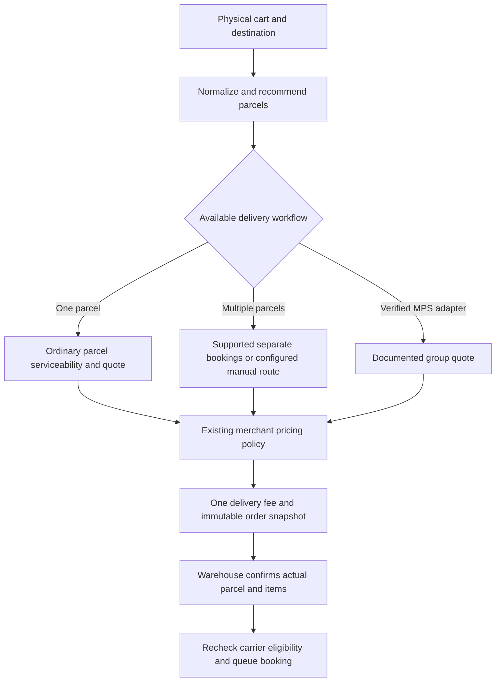

# Shipping and packaging implementation plan

Date: 2026-10-06. Status: proposed, ready for staged implementation; MPS API contract remains unverified.

## Summary

Use product shipping measurements, a small reusable box catalog, a deterministic volume-based packing recommendation, and measured warehouse parcels. Show customers one delivery fee. Keep the customer's fee separate from the carrier's estimated and actual costs.

Build on the existing shipping modules, JSON settings, quote/order snapshots, shipment items, and operation queue. Do not introduce a packing service, a new warehouse system, a 3D solver, or a mandatory product-to-box matrix.

The pasted recommendation is directionally useful, but its assertion that every platform uses the exact same algorithm and pricing model is too strong. Most proposed Phase 1 backend changes are already committed at `6d82e25`. The next work is correcting packing capacity, quote representation, cache isolation, and warehouse confirmation.

## What I found in this repository

| Area | Observed state | Required action |
|---|---|---|
| Product measurements | Products and variants already have weightGrams, lengthCm, breadthCm, heightCm; products have requiresShipping | Reuse these fields; document shipping-ready dimensions and variant inheritance |
| Package catalog | Profiles and legacy default package already have external dimensions, tare, content-weight and item limits | Improve UI, add explicit default selection and usable inner dimensions |
| fits[] | Empty lists allow automatic individual dimensional checks; nonempty lists act as product allowlists | Preserve legacy meaning during migration; make ordinary presets independent of fit rules |
| Mixing | Blank groups mix; matching explicit groups mix; other groups separate | Preserve behavior and fix misleading text at ShippingPage.jsx around line 680, as well as legacy fit helpers |
| Capacity | Automatic candidates and existing parcels enforce weight/count but not cumulative volume | Track remaining volume on every packing path |
| Ordering | Final candidate sort prioritizes capacity; items prioritize candidate count/weight | Replace with documented deterministic volume heuristic; do not describe current code as volume FFD |
| Multi-box quote | One serviceability call uses sum of rounded parcel weights and maxima of parcel sides; response copied onto each parcel | Distinguish aggregate order estimates from real parcel/group quotes |
| Aggregate geometry | buildCheckoutContext sums box volumes but exposes component-wise max dimensions | Those dimensions do not represent the aggregate volume or a real box; never book or attest fit using them |
| Warehouse override | manualPackage accepted; manual mode bypasses planned matching. Mismatch otherwise warns unless strict matching enabled | Make actual box confirmation primary; retain quantity, payment and provider guards |
| Cache | Module-global Map, five-minute TTL, key includes route/weight/dimensions/COD/value/courier | Add provider/account namespace, normalized keys, actual size eviction and single-flight |
| Fulfillment safety | Order/payment locks, remaining-quantity checks, ShipmentItem mappings, persisted provider operations exist | Reuse and test them; avoid a parallel booking pipeline |
| Pricing precedent | ADR 0003 accepts order-level flat/percentage/threshold fees, per-parcel slab freight, COD fee once | Preserve these semantics unless an explicit later business decision supersedes them |
| Historical plans | Existing multi-package/MPS plans contain statements that API orders are unconditionally blocked | Update their current-state sections after implementation; do not treat them as current code evidence |

Reproduction on the current tree: two 9 × 9 × 9 cm, 100 g items with quantity 2 and a 10 × 10 × 10 cm box (maxItems 10, maxContentsWeightGrams 5000) produce one parcel. Contents volume is 1458 cm³; available box volume is 1000 cm³. This is a concrete capacity bug, not merely a 3D packing limitation.

Verification baseline: seven focused server suites passed, 189 tests. This proves existing covered behavior; it does not prove physical packing or live provider compatibility. No provider bookings were made.

## Documentation evidence and corrections

Primary sources checked on 2026-10-06. These sources justify design principles; the proposed implementation choices below are our engineering decisions.

| Source | Verified behavior | Consequence for this plan |
|---|---|---|
| [Shopify packages](https://help.shopify.com/en/manual/fulfillment/setup/packaging/setting-up-packages) | Saved packages, one default, external dimensions; default for ordinary multi-item checkout; packed-size selection has eligibility/fallback rules | Use presets and a default; missing data must not be silently treated as a proven fit |
| [Shopify packedDimensions changelog](https://shopify.dev/changelog/posts/manage-packed-product-dimensions-with-the-admin-graphql-api) | September 29 update describes packedDimensions in API version 2027-01 and eligible smallest-package selection | API version name does not establish availability in every stable integration today; no Shopify API integration needed here |
| [WooCommerce box packing](https://woocommerce.com/document/understanding-box-packing-calculations/) | Speed Packer uses dimension checks plus volume; Accurate Packer uses spatial placement. Inner dimensions, weight limits and padded shipping dimensions matter | Volume packing is an estimate. Measure usable interior separately from billed exterior |
| [BoxPacker principles](https://boxpacker.io/en/stable/principles.html) | Largest-volume-first with spatial stacking, side-by-side placement and multi-box weight balancing | Sorted-sides plus volume is not the exact BoxPacker algorithm; optimal minimum count is not guaranteed |
| [ShipStation multi-package labels](https://help.shipstation.com/hc/en-us/articles/360035969732-Create-Multi-Package-Labels) | Per-box measurements, master/child tracking, carrier support restrictions | Shipment groups need actual provider support; independent ordinary bookings have independent AWBs |
| [Shiprocket MPS guide](https://support.shiprocket.in/support/solutions/articles/152000000706-what-is-multi-packet-shipment-how-to-create-it-) | Panel MPS workflow, account enablement, master AWB and package labels | Account enablement and a working website API adapter are separate. Existing project plan reports account activation; do not ask to activate it again |
| [Shiprocket API entrypoint](https://apidocs.shiprocket.in/) | Official integration reference; public rendering did not expose a verifiable MPS request/response contract in this research | Confirm account-specific contract before implementing automated MPS; absence from search is not proof no API exists |
| [Shiprocket volumetric guidance](https://support.shiprocket.in/support/solutions/articles/43000664204-how-to-calculate-the-volumetric-weight-of-my-shipment-) | Default divisor 5000, documented exceptions 4500/6000, rounded dimensions; article describes whole-kg rounding | Preserve configured 500 g merchant pricing, but do not claim every carrier bills in that slab. Confirm actual service/account rate rules |

The exact ShipStation Packing Recommendations beta requirements were not independently verified from an accessible primary help page here. Do not rely on third-party descriptions of that beta for implementation requirements. The official multi-package guide is sufficient evidence for per-box measurements and supported carrier workflows.

Two important corrections:

1. A single customer-facing fee is compatible with multiple real carrier charges. Independent bookings can legitimately each incur a minimum slab. If the store subsidizes them, make that a merchant pricing decision rather than fabricating a consolidated carrier price.
2. Isolation is a packing rule, not carrier authorization. Fragile goods do not universally require isolation; hazardous goods do not become supported simply by receiving a separate carton.

## Scope and decisions

Initial scope: domestic Indian B2C, one dispatch origin, rigid cartons, existing payment/providers and fulfillment records. Recommend 3–5 boxes; retain the existing server catalog limit. Existing manual delivery remains available when configured.

Implement first: presets, usable volume, standard/separate packing, predictable recommendations, coherent quotes, measured fulfillment, safe caching, backward-compatible migration.

Defer: automated MPS until contract verified, 3D coordinates, rotation restrictions for complex goods, box inventory forecasting, multi-warehouse routing, international customs, nested bundles, machine learning, package-set automation, freight optimization and a generic capability framework.

Use at most one planner-version setting for rollout, for example `shipping.packingVersion = legacy | volume_v1`. Reuse current pricingMode and rule settings. Verified MPS remains separately disabled in code until implemented; an admin checkbox alone must not authorize it.

## Data model and validation

### Product / variant

- Reuse existing measurement fields. Weight describes one shipping-ready unit, including permanent/unit-level protective packaging. Dimensions describe that unit in its shipping form: folded garment, rolled poster, padded retail item.
- Variant measurements inherit from the product only when absent; zero, negative, NaN and invalid present overrides must fail validation, not masquerade as inheritance. Treat the three dimension fields as a complete tuple: all absent or all valid. Backfill partially populated legacy tuples only after review.
- Add one product-level `packingMode`: `standard` (default) or `separate`. A separate item means one unit per parcel in v1, even if quantity > 1. Variant-level packing restrictions are deferred unless actual catalog needs prove otherwise.
- Preserve existing mix groups in the legacy path. Migration must surface restrictive legacy groups; never silently erase isolation. A migrated product may retain a simple optional mixGroup if needed to preserve merchant-confirmed grouping. Conflicting per-box grouping rules stay legacy until resolved.
- Digital goods require no measurements and never contribute packaging tare. Product shipping-data readiness is checked when publishing/selling physical goods; incomplete drafts are allowed.
- Missing weight prevents a weight-based carrier estimate. Missing dimensions may use a merchant-confirmed legacy fit/default policy with a visible low-confidence recommendation; otherwise provide configured manual delivery or a clear unavailable result. Do not invent 10 cm / 500 g measurements in production.

### Saved carton

- Reuse id, name, enabled, external L/W/H, emptyWeightGrams, maxContentsWeightGrams and maxItems. Keep maxItems as optional advanced capacity in the new UI; legacy values remain enforced.
- Add optional innerLengthCm / innerBreadthCm / innerHeightCm, all supplied together and no greater than their corresponding exterior dimensions. Packing uses the interior, carrier quotes use rounded exterior measurements.
- For legacy boxes lacking inner measurements, retain exterior-based approximate capacity and mark it for review. Do not label it measured interior or exact fit. Store staff can enter usable dimensions accounting for liner/padding.
- Preserve maxContentsWeightGrams meaning. Also enforce provider actual-weight/dimensional limits on packed tare + contents. Do not rename existing contents weight to total packed weight without conversion.
- Add a defaultPackageId in existing shipping JSON settings. Exactly one active default in the volume path. An old legacy default may be imported as a preset only by explicit save/review; keep the old setting until historical quotes no longer depend on it.
- Presets require no fits[]. Existing fit rules remain supported only in the legacy strategy/advanced view; no dimensions or restrictive rules are inferred from quantities.

### Quote and shipment snapshots

Extend existing JSON snapshots rather than add a packing-plan table:

```text
packingVersion, planHash, confidence (estimated | legacy_confirmed), warnings[]
parcels[]: existing parcelId, packageId/name, exterior dimensions,
           contentsWeight, tare, actualWeight estimate, volume, items/quantities
pricingBasis: merchant_rule | ordinary_single | separate_shipments | verified_mps
carrierEstimate: amount/currency/provider/courier and group or parcel references
customerShippingCost: existing persisted fee and tax/discount breakdown
```

For a split estimate, each parcel quote must identify its own measurements. Never copy one ordinary shipment rate onto every parcel and imply it is a per-parcel quote. Keep quote snapshots immutable after payment. Actual shipments record measured dimensions/weight, chosen courier and plan reference independently.

## Packing algorithm: small deterministic heuristic

Implement in shipping.packages.js as pure helpers, without provider calls or database access. Complexity must scale with lines, box types and resulting parcels; avoid creating an array entry per unit for large quantities.

1. Resolve measurements, remove digital lines, validate positive integer quantities, split isolation groups.
2. Sort lines by unit volume descending; break ties by weight, stable productId and variantId. Sort boxes by usable volume ascending and stable id.
3. An item individually fits when sorted sides fit sorted usable box sides. This permits axis-aligned 90-degree rotation. It does not simulate diagonals, compression or nested objects.
4. Candidate quantity is bounded by remaining usable volume / unit volume, remaining content weight / unit weight, item limit, and retained legacy quantity cap where applicable. Use the same bounds for opening and reusing a parcel. Never allow a fit override to bypass known weight or dimensional limits.
5. For each active box type, perform a bounded largest-item-first trial using that box, considering only groups/items that individually fit. Also perform a mixed-size trial that opens the largest needed box and shrinks finished parcels to the smallest eligible preset. Reuse compatible open parcels first. Skip incomplete trials.
6. Score complete plans by parcel count, then total external volume, then total tare and stable ids. This avoids the obvious small-box-first mistake: opening three small boxes when one larger box can hold the order. It aims for fewer boxes; it is not a mathematical optimum guarantee.
7. Compute per-parcel tare and weights once. Produce stable parcel IDs and a deterministic hash. Every shippable unit appears exactly once; no unit crosses isolation boundaries.
8. If no complete valid plan exists, return a structured reason with affected lines. Use a configured manual route where available; do not invent an oversized carton or treat defaultPackageId as permission to exceed capacity.

Volume fit remains approximate even after fixing the bug: two 6 cm rigid cubes have only 432 cm³ total volume, but cannot both fit axis-aligned in a 10 cm cube. Show recommendations as estimates and require warehouse measurement. Prefer usable interior dimensions and real sample-order calibration over a new configurable fill-factor system in v1.

## Checkout pricing and provider workflows



| Packing result | Customer pricing | Carrier handling |
|---|---|---|
| One valid box | Existing merchant rule or ordinary live carrier quote | Quote that box's exterior dimensions and actual packed estimate |
| Multiple boxes, merchant rule pricing | One fee following ADR 0003; merchant absorbs differences | Validate each real parcel; use supported independent shipments or configured manual handling |
| Multiple boxes, exact carrier pricing | One displayed fee composed from parcel quotes | Quote real parcels; independent shipment minimums are real costs. Bound concurrency and reuse cache |
| Verified MPS | One fee following merchant policy or documented group rate | Use documented MPS group quote and later group booking, with master/child labels |
| Missing/unsupported packing | Configured manual fee where valid, otherwise unavailable with actionable explanation | No invented carrier eligibility |
| All digital | Zero shipping | No courier call or tare |

Recommended SMB default is the existing merchant-rule pricing with cached real parcel serviceability. Keep exact carrier pricing available; do not change a merchant currently using it silently. A consolidated estimate is allowed only as an explicitly described merchant estimate/subsidy, never proof all parcels are serviceable or a promised exact carrier cost.

Ordinary dispatch sends one measured parcel's L/B/H and actual packed kg per adhoc request, plus only that fulfillment's line quantities and allocated value. Only combine an entire order when it is physically in one confirmed box. Independent shipments get independent AWBs, not a synthetic master AWB.

Keep order-level free shipping/flat/percentage fees, per-parcel configured slab freight and COD fee once as accepted in ADR 0003. Free shipping to the customer does not zero carrier costs. Coupon and GST paths must preserve the existing single order charge.

Separate prepaid shipments can build on existing per-fulfillment request IDs and mappings. Before enabling split COD on a route, verify provider collection semantics and that parcel allocations, discount, tax and fees sum exactly to the remaining collectible order total. Allocate integer paise with the final parcel receiving rounding residue; cancellation/rebooking must not duplicate the first-parcel fee. If contract/allocation is unverified, restrict split COD to a configured supported workflow; do not disable unrelated prepaid orders.

Carrier calculation:

```text
actualPackedGrams = sum(unitShippingWeight × qty) + one tare per physical box
dimensionalGrams = ceil(externalL) × ceil(externalW) × ceil(externalH) / divisor × 1000
rawChargeableGrams = max(actualPackedGrams, dimensionalGrams)
merchantBillableGrams = roundUp(rawChargeableGrams, configured merchant slab)
```

Store raw and merchant-rounded values separately. Provider APIs receive actual measurements/weight according to their contract; do not submit a merchant-rounded dimensional weight as actual dead weight. Provider returned rate is authoritative for the estimate. Divisor/slab overrides apply to a verified courier service, not a stale display name. Keep 5000/500 g as existing merchant defaults; do not call them universal carrier rules.

## Cache and checkout performance

- Retain the in-memory cache; Redis is unnecessary at this stage.
- Namespace by provider record/account identity and config revision. Do not put credentials in keys/logs.
- Key all effective request inputs: origin/destination, provider-normalized weight, rounded external dimensions, payment mode, declared value and selected courier. Pincode + slab alone is unsafe. Quantize weight only when the verified endpoint/rate contract permits it.
- Keep the existing five-minute successful-response TTL initially. Give deterministic unserviceable results a shorter TTL (for example 30 seconds). Do not cache auth failures, timeouts or malformed responses as unserviceable.
- Hard-cap entries at 1000 with oldest-entry eviction even when every entry is fresh. Delete expired records and namespace changes. Use one in-flight promise per key; clear it in finally.
- For multiple real parcels, deduplicate identical requests and use at most three concurrent calls. Preserve each parcel's result. Every parcel must have an available applicable service; do not promise one courier for all when intersection is empty.
- Revalidate actual measured parcels before booking, bypassing stale cached eligibility when needed. A quote estimates checkout costs; it is not a reserved courier rate.
- Keep quote ownership/session checks. Include packing/config revision and actual normalized plan hash in quote idempotency. Recompute expired quotes and changes to quantities, variants, route, payment, coupon or pricing settings.

## Admin and warehouse UX

Use existing MUI pages/components; no new navigation section or design system.

Shipping settings → Packages: compact Small/Medium/Large rows showing exterior size, tare, contents limit and Default/Inactive badges. Primary actions Add box, Edit, Set default. Normal form asks name, outside dimensions, empty weight, maximum contents weight. Expand Usable space and advanced limits for inside dimensions/item cap. Put legacy product fit rules behind Advanced / Legacy rules with migration explanation.

Product shipping section: Physical product switch; unit shipping weight, shipping-ready L/W/H; variant inheritance helper; “Ship each unit separately” checkbox. Show data readiness and links from package migration review. Avoid SKU-to-box selection for ordinary goods.

Replace misleading helper with: “General goods can share a box. Use a restriction only when those items must be packed separately.” Explain that a matching legacy mix group permits sharing within that group; different groups and restricted-versus-general stay separate.

Order fulfillment dialog:

1. Select quantities from remaining unfulfilled items, with the recommended contents as a convenient starting point.
2. Choose saved box or Custom measured parcel. Preset fills exterior dimensions; all measurements remain editable before booking.
3. Enter/confirm actual packed weight including packaging. Do not add tare again to a scale measurement. Label an auto-filled weight “Estimated”; require confirmation before buying a label.
4. Show courier eligibility, customer fee already paid and revised carrier estimate where available. Show a compact “Changed from recommendation” notice, not a blocking mismatch error.
5. Create shipment through the existing operation queue. Pending/unknown booking disables duplicate create and exposes reconciliation/retry status. Booked parcels require existing cancel/rebook workflow to change dimensions.

Manual measurements remove plan-equality constraints only. They must not remove ownership, positive quantities, remaining stock/quantity, payment, COD, product restrictions, carrier limits or booking idempotency checks. Audit actor, item quantities, prior recommendation and actual measurements; a warning log alone is insufficient history.

Partial manual fulfillment must not make a whole recommended parcel appear completed. Recommendations are presentation hints; remaining order-item quantities determine what can still ship. Mixed manual/planned packing may need the remaining items re-recommended without mutating the paid quote.

Customer checkout: one delivery row, clear availability and delivery estimate; no packer internals. Order tracking: one card per real shipment with its products/quantities and tracking. Say “Partially delivered” while any physical parcel remains unresolved. Digital fulfillment stays separate from physical parcel progress.

## Use cases and edge cases

| Case | Required behavior / verification |
|---|---|
| Single SKU ×1 | Smallest eligible carton, correct exterior quote, tare once |
| Same SKU ×N | Capacity bounds include quantity × volume and quantity × weight |
| Mixed ordinary SKUs | Share if all bounds permit; stable result independent of cart line order |
| One larger versus several smaller boxes | Score complete candidates by count before volume |
| Remainder after full box | Shrink last box when eligible without adding parcels |
| Individual rotation | Sorted sides permit 90-degree axis rotations |
| Cumulative volume overflow | Two 9 cm cubes cannot enter one 10 cm box |
| Volume passes but spatial fit fails | Two 6 cm cubes example remains an estimate; warehouse override accepted |
| Long, flat, padded, soft goods | Use shipping-form measurements; rigid carton algorithm does not model deformation/mailers |
| Inner versus outer dimensions | Fit checks interior; rates use rounded exterior |
| Capacity exactly at boundary | Accept equality; next unit/slab exceeds capacity; consistent decimal tolerance |
| Weight-heavy / volume-heavy goods | Respect contents limit, tare and max(actual, dimensional) separately |
| Missing weight/dimensions | No guessed production measurements; explicit legacy/manual fallback or unavailability |
| Variant missing versus zero override | Missing inherits, zero/invalid fails; partial dimension tuples need review |
| Digital-only / mixed cart | No digital tare/parcel/courier; zero shipping for digital-only |
| Separate mode with quantity 3 | Three unit parcels; no mixing even with same SKU |
| Legacy restrictive fits/groups | Preserve grouping and quantity caps until merchant reviews migration |
| Default inactive/deleted | Prevent removing current default until replacement saved; historical snapshots survive |
| No fitting carton / oversized item | Configured manual alternative or unavailable; no pretend default-box fit |
| Large quantity / many lines | Bounded work using quantity chunks; no per-unit expansion or uncontrolled calls |
| Guest checkout | Quote ownership stays session-bound; packing/pricing same as logged-in |
| Coupon / free shipping / GST | Customer discount applies once; carrier cost unaffected; current tax behavior preserved |
| COD multi-parcel | Exact collectible allocation, fee once, no double collection on retries/cancellation |
| Different courier eligibility per parcel | Validate all parcels; no copied consolidated serviceability claim |
| Courier max dead/dimensional weight | Enforce documented limit type and dimensions at quote and booking |
| Courier/config changes after payment | Preserve paid fee; recheck dispatch carrier, record revised estimate, no silent customer recharge |
| Manual combined or split contents | Allowed with valid remaining quantities and measured parcels; audit mismatch |
| Concurrent warehouse staff | Existing order lock prevents quantity duplication; pending bookings reserve quantities |
| Request timeout after carrier accepted | Unknown outcome reconciles by persisted request reference; never blindly create again |
| Label succeeds, pickup fails | Retry failed stage using existing shipment identity |
| Cancel one parcel / rebook | Release reservation only after cancellation confirmed; retain amounts/audit |
| One delivered, one RTO/lost | Order remains partial; refunds/stock operate on actual affected quantities |
| Duplicate/out-of-order webhook | Existing dedupe/status rules prevent regression and double side effects |
| Cache many fresh keys | Size stays bounded, provider accounts never share responses |
| Cache timeout/auth failure | Retryable operational error distinct from confirmed no-service result |
| Restricted/hazardous goods | Do not route merely because isolated; only explicitly supported carrier workflow |

## Implementation phases and acceptance gates

### Phase 0 — establish the real baseline

Completed for this plan: read current modules, attached prior claims, existing ADR/plans; verified primary docs; identified commit 6d82e25; ran seven focused suites (189 passing); reproduced volume overflow. Working tree contains unrelated ongoing edits, including OrderDetailPage.jsx. Preserve those edits and scope later changes carefully. Do not commit the working tree wholesale.

Before code work: confirm actual box measurements and the top representative orders from the merchant catalog. The recommendation does not require guessing box sizes from industry examples.

### Phase 1 — correct existing contracts and capacity

- Add the cumulative-volume regression and capacity enforcement for automatic presets, including additions to already open parcels. Known dimensions must not be bypassed by legacy fits/defaults.
- Remove copied per-parcel quote claims and aggregate-max-dimensions carrier quoting. Use real one-box quotes or existing merchant-rule pricing plus real parcel serviceability.
- Preserve ADR 0003 and price/fee ownership. Add cache namespace, hard cap, error policy and single-flight.
- Correct mix-group copy throughout ShippingPage.jsx. Make existing measured manual flow visible and confirm weight.
- Keep manual mismatch as audit/warning; require physical measurement when changed contents invalidate the recommended box. Preserve strict matching as an explicit legacy option, not a default packing constraint.

Gate: reproduction rejected/split, legitimate mixed carts still work, ordinary single-box quote uses matching actual dimensions/weight, cache cannot leak account-specific rates, no lost quantity/payment guards. No automated MPS claims.

### Phase 2 — migrate to volume_v1 presets and warehouse confirmation

- Add packingMode migration with standard default, inner dimensions/defaultPackageId in JSON settings, and the bounded trial planner.
- Add a preview-only migration report: missing/partial measurements, conflicting legacy rules, restrictive groups, disabled boxes and default readiness. Never derive item dimensions from fits[].
- Merchant reviews measurements and group conflicts. Enable volume_v1 only for reviewed configuration; incomplete stores retain legacy behavior. Shadow-compare sample orders first using a script/admin preview, not a permanent second production packing service.
- Save versioned snapshots; update product/package/fulfillment forms; recheck actual parcel eligibility before queuing shipment creation.
- Old paid orders fulfill from saved snapshots and measured overrides. Do not recompute historical prices using the new planner.

Gate: quantity conservation/determinism tests, realistic sample orders physically verified, migration can be rolled back by setting without altering orders, existing unit/integration suites and client build pass.

### Phase 3 — provider-specific multi-parcel delivery

- Harden independent shipment values/COD allocation and customer tracking using existing shipment records. Enable only confirmed payment/provider workflows.
- For MPS obtain sanitized account-specific examples of quote/create, package representation, supported courier/payment limits, master/child identifiers, labels, pickup, lookup after timeout, cancellation and webhook schemas. The existing reported account activation is retained; only API/integration readiness is unresolved.
- Implement only the documented adapter and required group references. Add a group entity only if that contract actually needs atomic group lifecycle; do not invent a master AWB by joining ordinary shipments.
- Use a bounded explicit operational test with authorization before purchasing live labels. Provider mocks prove our code contract, not live account support.

Gate: real contract is verified, retries cannot duplicate labels, group pricing and COD reconcile, partial failure/tracking works. MPS may remain deferred while Phases 1–2 ship.

## Files expected to change during implementation

| File / area | Purpose |
|---|---|
| server/src/modules/shipping/shipping.packages.js | Volume bounds, deterministic recommendation and legacy strategy |
| server/src/modules/shipping/shipping.package.js | Default/preset compatibility validation |
| server/src/modules/shipping/shipping.service.js | Plan normalization, quote basis, real parcel eligibility and snapshots |
| server/src/modules/shipping/shipping.settings.js and shipping.validation.js | New version/default/interior validation and API compatibility |
| server/src/modules/shipping/providers/shiprocket.provider.js | Account-safe cache, correct effective weights/dimensions and later documented MPS adapter |
| server/src/modules/order/order.service.js and order.validation.js | Actual parcel confirmation, item conservation, audit and value allocation |
| server/src/modules/product/product.model.js and product.validation.js | Standard/separate packing mode and measurement tuple validation |
| Product admin shipping forms, located before implementation | Shipping-ready dimensions, inheritance and isolation control |
| server/migrations/new dated packing-mode migration | Add only required product column; rollback preserves data compatibility |
| client/src/pages/admin/ShippingPage.jsx | Presets/default/legacy rules and truthful helper text |
| client/src/pages/admin/OrderDetailPage.jsx | Recommended versus actual parcel flow; preserve existing unrelated edits |
| Existing shipping/order tests plus targeted new regressions | Capacity, quotes, cache, overrides, retries and money conservation |
| docs/SHIPPING-SYSTEM.md, docs/SHIPROCKET-INTEGRATION.md, existing package/MPS plans | Replace stale current-state claims and document final behavior |

No runtime files changed by this planning task. Exact changed file: this plan only.

## Commands to run and verification

Baseline command actually run from repository root:

```bash
npm --prefix server test -- --run tests/unit/shipping.package.test.js tests/unit/shipping.service.test.js tests/unit/shipping.auditFixes.test.js tests/unit/shipping.auditHardening.test.js tests/unit/shipping.edgeCases.test.js tests/unit/shipping.pricingFlow.test.js tests/unit/order.service.test.js
```

Result: 7 files, 189 tests passed on 2026-10-06. The standalone planParcels volume reproduction also ran and exposed the invalid one-box result described above.

After implementation:

```bash
npm --prefix server test -- --run
npm --prefix client test
npm --prefix client run build
```

Run database migration only in the intended test/staging environment when Phase 2 exists:

```bash
npm --prefix server run migrate
```

Add meaningful tests rather than snapshots mirroring code: volume/quantity/weight invariants, deterministic line-order behavior, cache account separation and bounded eviction, actual versus chargeable API weight, fulfilled quantity races, money/COD conservation, ambiguous booking retries, immutable paid snapshots and mixed manual/planned fulfillment. Verify responsive forms, keyboard controls, error focus and unit labels in browser QA. Physically pack representative single/mixed/bulk/restricted orders; software tests alone cannot validate geometry.

## Rollout, risks and remaining decisions

Release Phase 1 independently, then opt reviewed stores into volume_v1. Keep historical JSON readers compatible and the previous planner selectable for new quotes during rollback. Previously paid snapshots remain unchanged. Do not remove fits[] storage or legacy default settings in this release.

Measure with existing logs: quote latency/provider call count, fallback/missing-measurement rate, recommendation override frequency, estimated versus measured billable weight, quote versus booked cost where available, split booking failures and COD allocation discrepancies. Do not add a metrics platform solely for packing.

Main risks: volume estimates can understate spatial requirements; merchant pricing may subsidize split costs; incomplete measurements undermine estimates; service contracts determine slabs/limits; manual packing can change parcel count; MPS API and COD collection behavior remain account-specific.

Business choices to confirm at implementation: actual measured box inventory; whether a store intentionally absorbs split-carrier costs under its existing pricing mode; which restrictive legacy groups should survive migration. Recommended defaults are documented above, so these do not block capacity/cache/UI fixes or require an architecture redesign.

External prerequisite for automated MPS: verified account API contract. Continue implementing ordinary packing and measured fulfillment while that is obtained. This plan does not claim a live MPS integration has been tested or that all listed edge cases have already been implemented.
